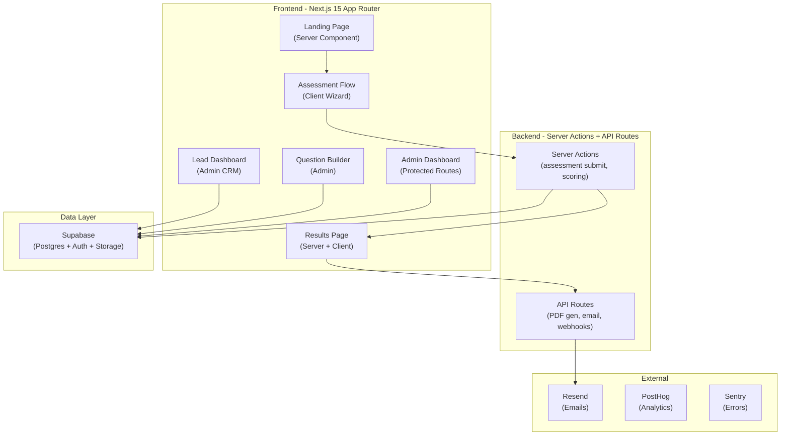

# Turn2Law Startup Legal Health Check — Implementation Plan

## Overview

Build a production-ready SaaS platform that allows Indian startups to self-assess their legal compliance health across multiple categories (incorporation, IP, employment, contracts, data privacy, regulatory), receive animated scores with detailed breakdowns, and connect with Turn2Law for remediation — all wrapped in a premium, handcrafted UI that matches the visual quality of Stripe, Vercel, Linear, and Arc Browser.

This is a **standalone Next.js application** in `c:\Users\moury\Coding\Turn2Law\Startup Legal Health-Checker` — a new codebase that shares the Turn2Law branding DNA from the existing [Legal Templates Library](file:///c:/Users/moury/Coding/Turn2Law/Legal%20templates%20Library/legal-templates) but is independently deployable.

---

## User Review Required

> [!IMPORTANT]
> **Supabase Project**: This app needs its own Supabase project (or can share the existing one from Legal Templates). Which do you prefer?
> - **Option A**: Reuse the existing Supabase project (same `SUPABASE_URL` and keys) — the health-checker tables will be added alongside the existing `templates`/`categories` tables.
> - **Option B**: Create a new, dedicated Supabase project for the Health Checker.

> [!IMPORTANT]
> **Authentication Strategy**: The admin panel needs auth. Should we:
> - **Option A**: Use the same cookie-based admin auth pattern as the Legal Templates app (`t2l_admin_session` cookie)?
> - **Option B**: Use Supabase Auth with magic link / email+password for admins?

> [!WARNING]
> **Third-party API Keys**: The plan references PostHog (analytics) and Sentry (error tracking). These can be integrated later — the app will work fully without them. I'll add placeholder env vars so you can plug them in when ready.

---

## Open Questions

1. **Email Service**: For sending assessment results and consultation booking confirmations — should I use Resend (recommended, works with React Email) or another provider?
2. **PDF Generation**: Should the downloadable report be generated server-side (using `@react-pdf/renderer`) or client-side?
3. **Consultation Booking**: Should "Book a Consultation" link to an external Calendly/Cal.com URL, or build an in-app booking flow?

---

## Architecture Overview



---

## Proposed Changes

### Phase 1: Project Foundation & Design System

#### [NEW] Project Scaffold

Initialize Next.js 15 project with the full dependency stack.

**Key files:**
- `package.json` — All dependencies (next, react 19, tailwindcss 4, shadcn, framer-motion, recharts, react-hook-form, zod, tanstack-query, lucide-react, react-pdf, react-email, drizzle-orm)
- `tsconfig.json` — Strict TypeScript with path aliases
- `next.config.ts` — Image domains, redirects, headers
- `tailwind.config.ts` — Turn2Law brand tokens
- `components.json` — ShadCN v4 config (base-nova style)
- `.env.local.example` — All required env vars documented

---

#### [NEW] `src/app/globals.css`

Complete design system with Turn2Law brand tokens:
- CSS custom properties for all brand colors (#D8A04C, #8E5F28, #F2D6A2)
- Gold gradient utilities
- Liquid glass effects (backdrop-blur, glass panels)
- Custom scrollbar (warm brown)
- Selection colors (golden)
- Animation keyframes (float, pulse-gold, shimmer, slide-up, fade-in)
- Responsive typography scale

---

#### [NEW] `src/lib/design-system/`

- `tokens.ts` — Brand color constants, spacing, typography scales
- `animations.ts` — Reusable Framer Motion variants (stagger, spring, elastic)
- `cn.ts` — Utility for merging classnames

---

### Phase 2: Premium UI Components

#### [NEW] `src/components/ui/` — Enhanced ShadCN + Custom Components

Standard ShadCN components customized with Turn2Law branding plus premium custom components:

| Component | Description |
|-----------|-------------|
| `animated-button.tsx` | Ripple effect, depth, glow, scale on hover |
| `glass-card.tsx` | Liquid glass card with 3D hover, shadow tracking, parallax |
| `animated-counter.tsx` | Count-up numbers with easing |
| `circular-gauge.tsx` | Animated SVG score gauge |
| `radar-chart.tsx` | Animated radar chart for category breakdown |
| `progress-ring.tsx` | Circular progress indicator |
| `floating-nav.tsx` | Sticky navbar with blur + scroll-driven opacity |
| `particle-background.tsx` | Canvas-based warm gold particles |
| `gradient-border.tsx` | Animated gradient border effect |
| `shimmer.tsx` | Loading shimmer skeleton |
| `scroll-reveal.tsx` | Intersection Observer + Framer Motion reveal |
| `tilt-card.tsx` | Mouse-following 3D tilt effect |
| `beam-effect.tsx` | Animated beam / spotlight |
| `magnetic-button.tsx` | Mouse-follow magnetic interaction |
| `morphing-text.tsx` | Text that morphs between values |
| `dock.tsx` | macOS-style dock for quick actions |

---

### Phase 3: Landing Page

#### [NEW] `src/app/page.tsx` — Landing Page (Server Component shell)

Composed of these sections, each a separate component:

#### [NEW] `src/components/landing/hero.tsx`
- Animated gold particle background (canvas)
- Floating legal icons (shield, scale, document) with parallax
- Bold headline with gold gradient text: "Know Your Startup's Legal Health Score"
- Animated subtitle with typing effect
- Primary CTA: "Start Free Assessment" with ripple + glow
- Secondary CTA: "See How It Works"
- Mouse-following spotlight effect
- Animated badge: "Trusted by 500+ Indian Startups"

#### [NEW] `src/components/landing/problem-section.tsx`
- Scroll-triggered reveal
- Three pain points with animated icons
- Statistics with count-up animation (e.g., "78% of startups face legal issues in first 2 years")

#### [NEW] `src/components/landing/benefits.tsx`
- Staggered card reveal
- 3D tilt cards with hover effects
- Icon + title + description for each benefit

#### [NEW] `src/components/landing/how-it-works.tsx`
- Animated timeline/stepper
- 4 steps: Answer Questions → Get Score → See Risks → Get Help
- Each step animates in on scroll with connecting beam effects

#### [NEW] `src/components/landing/stats-section.tsx`
- Animated counter numbers
- Golden gradient dividers
- Key platform statistics

#### [NEW] `src/components/landing/testimonials.tsx`
- Carousel with smooth transitions
- Founder photos, company names, quotes
- Star ratings with golden stars

#### [NEW] `src/components/landing/faq.tsx`
- Animated accordion with smooth height transitions
- Grouped by topic

#### [NEW] `src/components/landing/cta-section.tsx`
- Full-width gradient background
- Floating elements
- Strong CTA with animated button

---

### Phase 4: Assessment Flow

#### [NEW] `src/app/assessment/page.tsx`
- Multi-step wizard container

#### [NEW] `src/components/assessment/wizard.tsx`
- Step-by-step form wizard with:
  - Animated progress bar (golden gradient fill)
  - Step indicators with completion animations
  - Smooth slide transitions between steps (Framer Motion `AnimatePresence`)
  - Autosave to `localStorage` on every answer change
  - Resume capability (checks localStorage on mount)
  - Category-based grouping of questions

#### [NEW] `src/components/assessment/question-types/`
- `single-choice.tsx` — Radio-style with animated selection
- `multi-choice.tsx` — Checkbox-style with spring animations
- `yes-no.tsx` — Toggle with elastic bounce
- `scale.tsx` — Slider with gradient track
- `text-input.tsx` — Animated label, validation glow
- `date-input.tsx` — Date picker with smooth open/close

#### [NEW] `src/components/assessment/step-navigation.tsx`
- Back/Next buttons with loading states
- Step indicator dots with pulse on active
- Keyboard navigation (arrow keys, Enter)

#### [NEW] `src/lib/assessment/questions.ts`
- Complete question bank organized by category:
  - **Company Formation** (10 questions): Registration, DPIIT, compliance
  - **Founder Agreements** (8 questions): SHA, vesting, IP assignment
  - **Employment & HR** (10 questions): Contracts, PF, POSH, NDA
  - **Intellectual Property** (8 questions): Trademarks, patents, copyrights
  - **Contracts & Commercial** (8 questions): Customer terms, vendor agreements
  - **Data Privacy & IT** (8 questions): Privacy policy, DPDP Act, IT Act
  - **Regulatory & Compliance** (8 questions): GST, RBI, SEBI, sector-specific
- Each question has: `id`, `category`, `text`, `helpText`, `type`, `options`, `weight`, `riskLevel`

#### [NEW] `src/lib/assessment/scoring.ts`
- Weighted scoring engine
- Category-level scores (0-100)
- Overall health score (weighted average)
- Risk level classification (Critical / High / Medium / Low / Healthy)
- Recommendation generation based on answers
- Priority ranking algorithm

---

### Phase 5: Results Page

#### [NEW] `src/app/results/[id]/page.tsx`
- Server component that fetches assessment data
- Passes to client components for animation

#### [NEW] `src/components/results/score-hero.tsx`
- Large animated circular gauge (SVG) filling from 0 to score
- Color transitions (red → orange → gold → green) based on score
- Animated number counter
- Risk level badge with glow effect
- Confetti/celebration for high scores

#### [NEW] `src/components/results/category-breakdown.tsx`
- Animated radar chart (Recharts + Framer Motion)
- Individual category progress bars with stagger animation
- Click to expand category details

#### [NEW] `src/components/results/risk-matrix.tsx`
- 2D risk matrix (likelihood × impact)
- Animated dot placement
- Hover to see risk details
- Color-coded severity

#### [NEW] `src/components/results/recommendations.tsx`
- Timeline-style list of recommendations
- Priority badges (Critical / High / Medium / Low)
- Expandable cards with detailed action items
- "Mark as done" functionality (persisted)
- Estimated cost / time for each

#### [NEW] `src/components/results/download-report.tsx`
- "Download PDF Report" button with loading animation
- Server-side PDF generation via API route

#### [NEW] `src/components/results/book-consultation.tsx`
- Prominent CTA card
- Pre-filled with assessment context
- Calendar icon with animation

---

### Phase 6: Admin Dashboard

#### [NEW] `src/app/admin/layout.tsx`
- Protected layout with sidebar
- Auth check via middleware

#### [NEW] `src/components/admin/sidebar.tsx`
- Responsive sidebar (collapsible on mobile)
- Navigation: Dashboard, Assessments, Questions, Leads, Settings
- Active state with golden accent
- User avatar + role display
- Quick action buttons

#### [NEW] `src/app/admin/page.tsx` — Analytics Dashboard
- Key metrics cards with animated counters:
  - Total Assessments
  - Average Score
  - Completion Rate
  - Leads Generated
- Score distribution chart (bar chart)
- Assessments over time (line chart)
- Category risk heatmap
- Recent assessments table
- Quick actions dock

#### [NEW] `src/app/admin/questions/page.tsx` — Question Builder
- Drag & drop question ordering (using `@dnd-kit`)
- Add/edit/delete questions
- Question type selector
- Conditional logic builder (show question if previous answer = X)
- Weight adjustment sliders
- Preview mode
- Category management

#### [NEW] `src/app/admin/leads/page.tsx` — Lead Dashboard
- CRM-style table with:
  - Search + filters (risk level, date range, score range)
  - Pipeline view (New → Contacted → Qualified → Client)
  - Company timeline (all interactions)
  - Assessment history per lead
  - Bulk actions (export CSV, send email)
  - Click to expand full assessment details

#### [NEW] `src/app/admin/assessments/page.tsx`
- All assessments with filtering
- Score distribution analytics
- Export capabilities

---

### Phase 7: Database Schema

#### [NEW] `supabase/migrations/001_health_checker.sql`

```sql
-- Assessment Categories
CREATE TABLE assessment_categories (
  id UUID PRIMARY KEY DEFAULT gen_random_uuid(),
  name TEXT NOT NULL,
  slug TEXT NOT NULL UNIQUE,
  description TEXT,
  icon TEXT DEFAULT 'Shield',
  weight DECIMAL(3,2) DEFAULT 1.0,
  sort_order INTEGER DEFAULT 0,
  is_active BOOLEAN DEFAULT true,
  created_at TIMESTAMPTZ DEFAULT now(),
  updated_at TIMESTAMPTZ DEFAULT now()
);

-- Assessment Questions
CREATE TABLE assessment_questions (
  id UUID PRIMARY KEY DEFAULT gen_random_uuid(),
  category_id UUID REFERENCES assessment_categories(id) ON DELETE CASCADE,
  text TEXT NOT NULL,
  help_text TEXT,
  type TEXT NOT NULL CHECK (type IN ('single_choice','multi_choice','yes_no','scale','text','date')),
  options JSONB DEFAULT '[]',
  weight DECIMAL(3,2) DEFAULT 1.0,
  risk_level TEXT CHECK (risk_level IN ('critical','high','medium','low')),
  conditional_logic JSONB, -- {showIf: {questionId, operator, value}}
  sort_order INTEGER DEFAULT 0,
  is_active BOOLEAN DEFAULT true,
  created_at TIMESTAMPTZ DEFAULT now(),
  updated_at TIMESTAMPTZ DEFAULT now()
);

-- Assessment Submissions
CREATE TABLE assessments (
  id UUID PRIMARY KEY DEFAULT gen_random_uuid(),
  company_name TEXT NOT NULL,
  company_email TEXT NOT NULL,
  company_stage TEXT, -- pre-seed, seed, series-a, etc.
  industry TEXT,
  founder_name TEXT,
  phone TEXT,
  answers JSONB NOT NULL DEFAULT '{}',
  scores JSONB NOT NULL DEFAULT '{}', -- {overall, categories: {cat_id: score}}
  overall_score DECIMAL(5,2),
  risk_level TEXT,
  recommendations JSONB DEFAULT '[]',
  status TEXT DEFAULT 'completed',
  ip_address TEXT,
  user_agent TEXT,
  completed_at TIMESTAMPTZ DEFAULT now(),
  created_at TIMESTAMPTZ DEFAULT now()
);

-- Assessment Leads (CRM)
CREATE TABLE assessment_leads (
  id UUID PRIMARY KEY DEFAULT gen_random_uuid(),
  assessment_id UUID REFERENCES assessments(id) ON DELETE SET NULL,
  company_name TEXT NOT NULL,
  email TEXT NOT NULL,
  phone TEXT,
  founder_name TEXT,
  pipeline_stage TEXT DEFAULT 'new' CHECK (pipeline_stage IN ('new','contacted','qualified','proposal','client','lost')),
  notes JSONB DEFAULT '[]',
  tags TEXT[] DEFAULT '{}',
  last_contacted_at TIMESTAMPTZ,
  created_at TIMESTAMPTZ DEFAULT now(),
  updated_at TIMESTAMPTZ DEFAULT now()
);

-- Admin Users (reuse pattern from Legal Templates)
CREATE TABLE health_admin_users (
  id UUID PRIMARY KEY REFERENCES auth.users(id) ON DELETE CASCADE,
  email TEXT NOT NULL UNIQUE,
  role TEXT DEFAULT 'admin',
  created_at TIMESTAMPTZ DEFAULT now()
);
```

Plus indexes, RLS policies, and trigger functions.

---

### Phase 8: Server Actions & API Routes

#### [NEW] `src/lib/actions/assessment.ts`
- `submitAssessment()` — Validates, scores, stores, returns result ID
- `getAssessmentById()` — Fetch full assessment with scores

#### [NEW] `src/lib/actions/admin.ts`
- CRUD operations for questions, categories, leads
- Pipeline stage updates
- Analytics aggregation queries

#### [NEW] `src/app/api/report/[id]/route.ts`
- PDF generation endpoint using `@react-pdf/renderer`
- Returns downloadable PDF with branded report

#### [NEW] `src/app/api/email/route.ts`
- Send assessment results email via Resend + React Email

---

### Phase 9: Email Templates

#### [NEW] `src/lib/emails/assessment-results.tsx`
- React Email template for assessment results
- Turn2Law branding (gold + black)
- Score summary, top risks, CTA to full results

---

### Phase 10: Layout & Navigation

#### [NEW] `src/components/layout/navbar.tsx`
- Floating navbar with backdrop-blur
- Turn2Law logo
- Navigation links
- CTA button with glow
- Mobile hamburger with animated transform

#### [NEW] `src/components/layout/footer.tsx`
- Branded footer
- Links, social, legal notices

---

### Phase 11: SEO & Performance

#### [NEW] `src/lib/constants/seo.ts`
- Site config for health checker
- Schema.org generators (WebApplication, FAQPage, Organization)

#### [NEW] `src/app/robots.ts`, `src/app/sitemap.ts`
- Standard SEO files

#### Performance Targets
- Dynamic imports for heavy components (Recharts, PDF)
- Image optimization via next/image
- Server Components by default, `"use client"` only where needed
- Streaming with Suspense boundaries

---

## File Structure Summary

```
src/
├── app/
│   ├── page.tsx                    # Landing page
│   ├── layout.tsx                  # Root layout
│   ├── globals.css                 # Design system
│   ├── assessment/
│   │   └── page.tsx                # Assessment wizard
│   ├── results/
│   │   └── [id]/page.tsx           # Results page
│   ├── admin/
│   │   ├── layout.tsx              # Admin layout + sidebar
│   │   ├── page.tsx                # Analytics dashboard
│   │   ├── login/page.tsx          # Admin login
│   │   ├── questions/page.tsx      # Question builder
│   │   ├── leads/page.tsx          # Lead CRM
│   │   └── assessments/page.tsx    # Assessment list
│   └── api/
│       ├── report/[id]/route.ts    # PDF generation
│       └── email/route.ts          # Email sending
├── components/
│   ├── ui/                         # Design system components
│   ├── landing/                    # Landing page sections
│   ├── assessment/                 # Assessment wizard components
│   ├── results/                    # Results page components
│   ├── admin/                      # Admin components
│   └── layout/                     # Navbar, footer, sidebar
├── lib/
│   ├── supabase/                   # DB clients
│   ├── actions/                    # Server actions
│   ├── assessment/                 # Questions, scoring engine
│   ├── constants/                  # SEO, branding
│   ├── design-system/              # Tokens, animations
│   ├── emails/                     # React Email templates
│   └── utils.ts                    # Shared utilities
└── middleware.ts                   # Route protection
```

Estimated file count: ~60-70 files

---

## Execution Strategy

Due to the project's scale, I'll build in this order:

| Order | Phase | Description | Est. Files |
|-------|-------|-------------|------------|
| 1 | Foundation | Project init, dependencies, design system, layout | 12 |
| 2 | UI Components | All reusable premium components | 15 |
| 3 | Landing Page | All landing sections with animations | 10 |
| 4 | Assessment | Wizard, questions, scoring engine | 12 |
| 5 | Results | Score display, charts, recommendations, PDF | 8 |
| 6 | Admin | Dashboard, question builder, leads CRM | 10 |
| 7 | Backend | DB schema, server actions, API routes, email | 8 |
| 8 | Polish | Responsiveness, accessibility, SEO, performance | 5 |

---

## Verification Plan

### Automated Tests
```bash
npm run build          # TypeScript compilation + Next.js build
npm run lint           # ESLint check
npx tsc --noEmit       # Type checking
```

### Manual Verification
- Run `npm run dev` and visually verify each page
- Test assessment flow end-to-end
- Verify responsive layouts at all breakpoints
- Test keyboard navigation on all interactive elements
- Confirm all animations are smooth (60fps)
- Validate PDF generation
- Test admin dashboard CRUD operations
